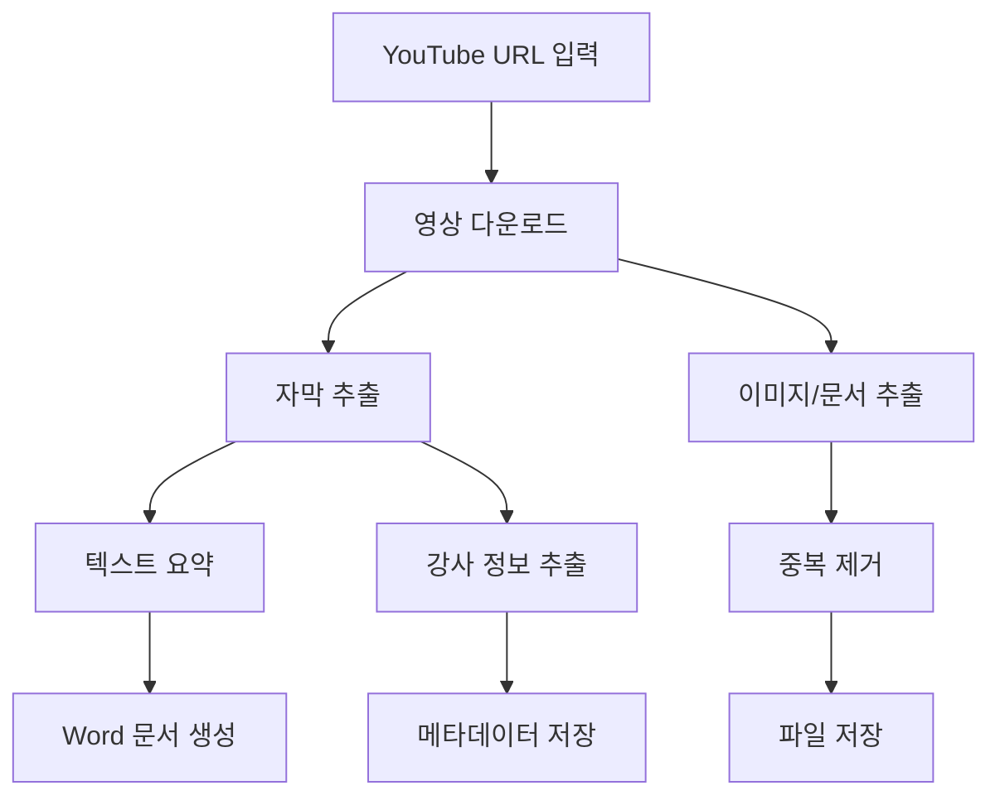

# YouTube Video Processing Project

## 1. 프로젝트 구조

```
youtube_processor/
├── src/
│   ├── video_processor/      # 영상 처리 관련 모듈
│   │   ├── downloader.py     # 영상 다운로드
│   │   ├── transcriber.py    # 자막 추출
│   │   └── extractor.py      # 이미지/문서 추출
│   ├── text_processor/       # 텍스트 처리 관련 모듈
│   │   ├── summarizer.py     # 텍스트 요약
│   │   └── deduplicator.py   # 중복 제거
│   ├── document_generator/   # 문서 생성 관련
│   │   └── word_generator.py # Word 문서 생성
│   └── utils/                # 유틸리티 함수
├── output/                   # 출력 디렉토리
│   ├── summaries/           # 요약 문서
│   ├── images/              # 추출된 이미지
│   ├── documents/           # 추출된 문서
│   └── metadata/            # 메타데이터
└── tests/                   # 테스트 코드
```

## 2. 프로세스 흐름도



## 3. 중복 제거 전략

### 3.1 추출 시 중복 제거 (권장)
- 장점:
  - 메모리 사용량 최적화
  - 처리 시간 단축
  - 저장 공간 효율적
- 구현 방법:
  - 해시 기반 중복 검사
  - 이미지: 픽셀 해시 비교
  - 문서: 텍스트 해시 비교

### 3.2 추출 후 중복 제거
- 장점:
  - 구현이 간단
  - 추출 과정이 독립적
- 단점:
  - 추가적인 처리 시간
  - 메모리 사용량 증가

## 4. 설치 패키지

### 4.1 필수 패키지
```python
# 영상 처리
youtube-dl>=2021.12.17
pytube>=12.1.0
opencv-python>=4.5.0
Pillow>=8.0.0

# 텍스트 처리
nltk>=3.6.0
spacy>=3.0.0
transformers>=4.0.0

# 문서 처리
python-docx>=0.8.11
PyPDF2>=2.0.0
python-pptx>=0.6.18

# 유틸리티
tqdm>=4.62.0
requests>=2.26.0
beautifulsoup4>=4.10.0
```

### 4.2 설치 확인 및 설치 스크립트
```python
def check_and_install_packages():
    import pkg_resources
    import subprocess
    import sys
    
    required_packages = {
        'youtube-dl': '2021.12.17',
        'pytube': '12.1.0',
        'opencv-python': '4.5.0',
        'Pillow': '8.0.0',
        'nltk': '3.6.0',
        'spacy': '3.0.0',
        'transformers': '4.0.0',
        'python-docx': '0.8.11',
        'PyPDF2': '2.0.0',
        'python-pptx': '0.6.18',
        'tqdm': '4.62.0',
        'requests': '2.26.0',
        'beautifulsoup4': '4.10.0'
    }
    
    for package, version in required_packages.items():
        try:
            pkg_resources.require(f"{package}>={version}")
            print(f"{package} is already installed and up to date.")
        except pkg_resources.DistributionNotFound:
            print(f"Installing {package}...")
            subprocess.check_call([sys.executable, "-m", "pip", "install", f"{package}>={version}"])
        except pkg_resources.VersionConflict:
            print(f"Upgrading {package}...")
            subprocess.check_call([sys.executable, "-m", "pip", "install", "--upgrade", f"{package}>={version}"])
```

## 5. 주요 기능 모듈 설명

### 5.1 VideoProcessor
- YouTube 영상 다운로드
- 프레임별 이미지 추출
- 문서 파일 탐지 및 추출

### 5.2 TextProcessor
- 자막 텍스트 추출
- 텍스트 요약
- 중복 제거 처리

### 5.3 DocumentGenerator
- Word 문서 생성
- 이미지 삽입
- 텍스트 포맷팅

### 5.4 MetadataExtractor
- 강사 정보 추출
- 영상 메타데이터 수집
- 추출물 메타데이터 관리 