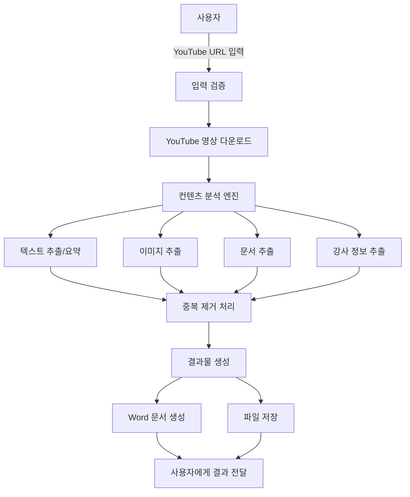
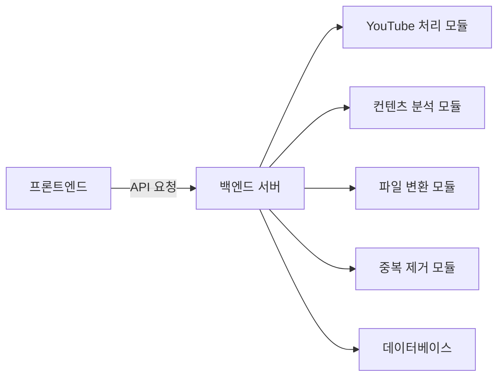

# 웹 기반 YouTube 영상 처리 시스템 구조

## 1. 시스템 흐름도



## 2. 주요 컴포넌트 관계도



## 3. 필요한 주요 패키지

### 3.1 백엔드 (Python)
- pytube (YouTube 영상 다운로드)
- python-docx (Word 문서 생성)
- opencv-python (이미지 처리)
- transformers (텍스트 요약)
- face_recognition (강사 얼굴 인식)
- pdf2image (PDF 처리)
- python-pptx (PPT 처리)
- fastapi/flask (웹 서버)
- numpy (데이터 처리)
- pillow (이미지 처리)

### 3.2 프론트엔드 (React/Next.js)
- axios (HTTP 클라이언트)
- material-ui/tailwindcss (UI 컴포넌트)
- react-dropzone (파일 업로드)
- react-query (데이터 페칭)

## 4. 중복 제거 전략

### 4.1 추출 당시 중복 제거
- 장점:
  - 저장 공간 효율적 사용
  - 처리 시간 단축
  - 실시간 처리 가능
- 단점:
  - 알고리즘 복잡도 증가
  - 실시간 처리로 인한 성능 부하

### 4.2 추출 후 중복 제거
- 장점:
  - 알고리즘 구현 단순
  - 더 정확한 중복 검사 가능
- 단점:
  - 추가 저장 공간 필요
  - 전체 처리 시간 증가

### 4.3 추천 방식
추출 당시 중복 제거를 권장합니다.

이유:
- 실시간 처리로 사용자 대기 시간 감소
- 저장 공간 효율적 사용
- 처리 비용 감소

## 5. 패키지 설치 확인 스크립트

```python
def check_and_install_packages():
    import pkg_resources
    import subprocess
    
    required = {
        'pytube': 'pytube',
        'python-docx': 'python-docx',
        'opencv-python': 'opencv-python',
        'transformers': 'transformers',
        'face_recognition': 'face_recognition',
        'pdf2image': 'pdf2image',
        'python-pptx': 'python-pptx',
        'fastapi': 'fastapi',
        'numpy': 'numpy',
        'pillow': 'Pillow'
    }
    
    installed = {pkg.key for pkg in pkg_resources.working_set}
    
    for package, pip_name in required.items():
        if package not in installed:
            subprocess.check_call(['pip', 'install', pip_name])
            print(f"Installed {pip_name}")
        else:
            print(f"{pip_name} is already installed") 